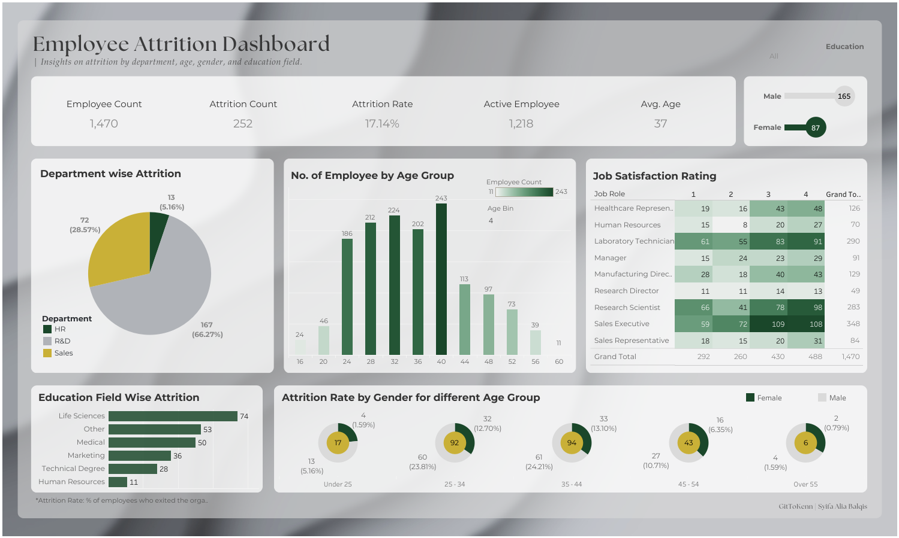

# HR Analytics Dashboard – Demo Company  

This project is inspired by an HR analytics dashboard exercise, reimagined with a fully **synthetic dataset**.  
Instead of relying on the widely reused IBM HR dataset, every column here has been **randomised and modified** from a public example to create a more realistic, anonymised version.  

The goal is to build a structured, reproducible pipeline that prepares the data for **employee attrition analysis and dashboard visualisation**. With the cleaned dataset, we can explore insights such as:  
- 📊 **Attrition patterns** by department, job role, and age group  
- 👥 Workforce composition across education, gender, and marital status  
- ⏳ Career dynamics: years at company, promotions, and manager changes  

---

🔗 **Featured on LinkedIn** : [View Post](https://www.linkedin.com/posts/syifa-alia-balqis_dataanalytics-tableau-python-activity-7378313421747974144-nT_u?utm_source=share&utm_medium=member_desktop&rcm=ACoAADnQ7pMBVWGhjXpj9_dswWCCHQQgDVd7MLo)                             
🛠️ **Status**: First dashboard (Employee Attrition) completed  
🔮 **Next Step**: Expand reasoning notes, add consistency checks, and develop additional dashboards  
🔓 **Repo**: Public  

---

## 🚀 Current Output  

#### Setting
```python
from IPython.display import display, Image
```
Here is the latest dashboard:

<div style="display: flex; justify-content: space-around; gap: 40px;">
  
</div>

---

*Then here is the link to view the interactive dashboard on Tableau Public*  

[Employee Attrition Dashboard on Tableau Public](https://public.tableau.com/views/HRAnalyticsDashboardDemoCompany/EmployeeAttritionDashboard?:language=en-GB&:sid=&:redirect=auth&:display_count=n&:origin=viz_share_link)

---

## 📌 Current Project Goals

- Refine the **synthetic HR dataset** to ensure randomisation is logical and well-justified  
- Improve the **data preparation notebook** with reasoning notes and consistency checks  
- Analyse **additional insights** beyond attrition (e.g. job satisfaction, promotions, demographics)  
- Build **new dashboards** to showcase these insights, with details documented in a dedicated insights file  

---

## 📂 Project Structure


- [README.md](README.md) – Project overview & documentation  
- [notebook/](notebook/) – Jupyter notebooks  
  - [01. data preparation.ipynb](notebook/01.%20data%20preparation.ipynb) – Synthetic HR data cleaning & preparation  
- [data/](data/) – Datasets  
  - [original/](data/original/) – Raw HR data (excluded via .gitignore)  
    - [HR Data.xlsx](data/original/HR%20Data.xlsx)  
  - [modified/](data/modified/) – Synthetic HR dataset (portfolio-ready)  
    - [HRDataset_Synthetic_2025-09-27_19-18.xlsx](data/modified/HRDataset_Synthetic_2025-09-27_19-18.xlsx)  
- [dashboard/](dashboard/) – Tableau workbooks (local only, excluded via .gitignore)  
  - HR Analytics Dashboard – Demo Company.twb  
  - Tutorial Dashboard.twb  
- [image/](image/) – Dashboard exports (screenshots)  
  - HR_Analytics_EmployeeAttrition_2025-09-27_20-51.png  
- [assets/](assets/) – Design assets (excluded via .gitignore)  
  - [background/](assets/background/) – Dashboard background templates  
  - [linkedin_media/](assets/linkedin_media/) – LinkedIn visuals / promotional media  
- [.gitignore](.gitignore) – Ignore raw data, Tableau files, and media assets  

---

### 🗂️ Folder Tree

```
root/
├── README.md
├── .gitignore
├── data/
│   ├── original/
│   │   └── HR Data.xlsx
│   └── modified/
│       └── HRDataset_Synthetic_2025-09-27_19-18.xlsx
├── notebook/
│   └── 01. data preparation.ipynb
├── dashboard/
│   ├── HR Analytics Dashboard – Demo Company.twb
│   └── Tutorial Dashboard.twb
├── image/
│   └── HR_Analytics_EmployeeAttrition_2025-09-27_20-51.png
└── assets/
    ├── background/
    │   └── 1st Ver _ HR Analytics Dashboard_Employee Attrition Dashboard.png
    └── linkedin_media/
```
---


## 📊 Dataset Overview

- **Source**: Based on an HR dataset from the *Data Tutorials* YouTube channel  
- **Modification**: All 39 columns have been **randomised and anonymised** to ensure uniqueness and realism  
- **Coverage**: 1,470 employee records across multiple departments and roles  
- **Variables**: Demographics, job details, compensation, satisfaction, and attrition indicators  
- **Format**: Excel (.xlsx), prepared for cleaning, analysis, and dashboard visualisation  

---

## 🧹 Cleaning & Processing Summary

- **Preserved original schema**: all columns retained with same labels.  
- **Randomised contents** while keeping similar ratios to original distributions.  
- **Applied rules for realism**:  
  - Dept ↔ Job Role / Education Field  
  - Job Role ↔ Overtime  
  - Job Level ↔ Income & Stock Options  
  - Age ↔ Age Band ↔ Marital Status  
- **Career timeline checks**:  
  - `TotalWorkingYears` ≤ Age – 18  
  - `YearsAtCompany` ≤ TotalWorkingYears  
  - Other tenure fields capped and biased by Job Level.  
- **Adjusted imbalances**:  
  - All `Over18` = "Y"  
  - Balanced education levels  
  - Reduced excessive “0 years” in tenure-related fields  
- **Exported** final randomised dataset to `modified/` with timestamped filenames.

---

## 🚀 Outputs  

- **Synthetic HR dataset** (randomised & anonymised, portfolio-ready)  
  - Preserves all original columns with realistic business rules applied  
  - Suitable for reproducible analysis and dashboarding  

- **Dashboards**  
  - *Employee Attrition Dashboard* (2025-09-27) – initial export completed  
  - Visualises attrition rate, demographics, education field, and job satisfaction  

👉 The dataset is ready for reuse, and new dashboards will be added as more insights are explored.  

---

## 🛡️ Disclaimer 

- This project is based on an HR dataset originally provided in a tutorial by the **Data Tutorials** YouTube channel.  
- All 39 columns have been **randomised and anonymised** to create a synthetic dataset suitable for portfolio and educational use.  
- The dataset is not identical to the one shared in the tutorial and does not contain any real employee records.  
- Original reference:  
  - [Data Tutorials YouTube Channel](https://www.youtube.com/@data_tutorials)  
